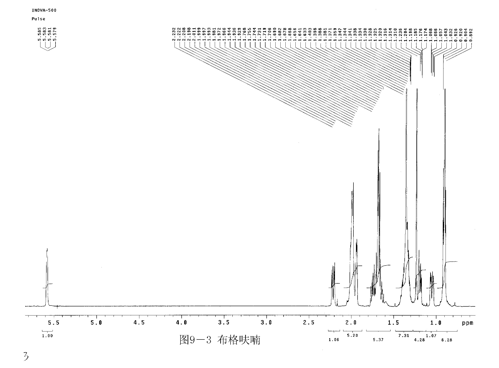
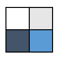
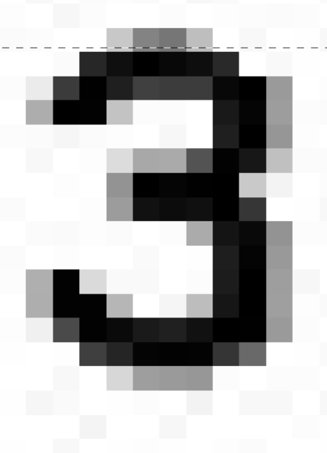
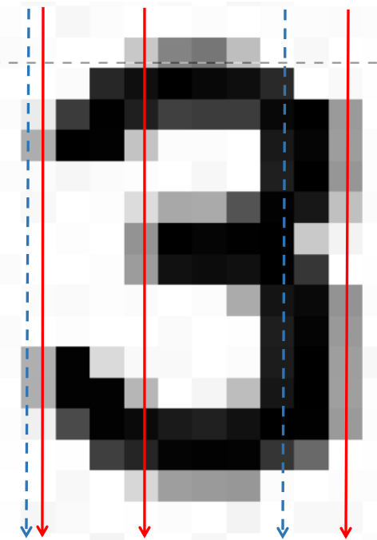
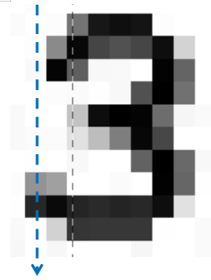
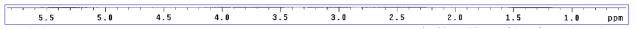
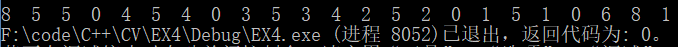

<center><h1>EX4 数字分割与识别</h1></center>

**输入图像如下**




## <font color=#3E63A7>任务一  分割图像前后景</font>

### <font color=#6899D3>分析</font>

* 很明显，这次的图片具有明显灰度差别，主要集中为黑色和白色，此时灰度直方图为双峰单谷型，取谷底点为阈值进行分割即可。

#### <font color=#A4C7F0>迭代法</font>

- 使用迭代法寻找所需阈值 $T$。先给 T 一个初值，然后每次迭代分别计算灰度小于 $T$ 和灰度大于等于 $T$ 的两个部分像素点的平均灰度值 $T_1$ 和 $T_2$， 并计算 $T_{new} = \frac{T_1 + T_2}{2}$；
- 若 $|T - T_{new}| > \Delta T$， 用 $T_{new}$ 作为新的 $T$ 继续迭代，否则结束寻找。

本次作业重点不在此，就简单分析一下。

### <font color=#6899D3>测试结果</font>


## <font color=#3E63A7>任务二 将图像中的数字切割出来</font>

### <font color=#4284D3>1. 膨胀操作</font>

#### <font color=#6899D3>分析</font>

* 本次作业是对黑色像素进行膨胀，而不是一般所指的白色像素。

* 因为原图中的数字比较小，并且数字之间的间隔也不是很大，如果使用 $3\times 3$ 的结构元可能会膨胀过度，所以我使用的是 $2\times 2$ 的结构元。

* 如下图，蓝色像素点为当前所在像素，求出该结构元覆盖的像素点的最小值作为当前像素的新值。

  <left></left>

#### <font color=#6899D3>实现</font>

```C++
void Digit::Dilate() {
	dilated = CImg<uchar>(grayscaled.width(), grayscaled.height(), 1, 1);
	int min;
	cimg_forXY(grayscaled, x, y) {
		min = 255;
		for (int i = -1; i <= 0; ++i)
			for (int j = -1; j <= 0; ++j)
				if (x + i >= 0 && x + i < grayscaled.width()
						&& y + j >= 0 && y + j < grayscaled.height()
						&& grayscaled(x + i, y + j) < min) {
					min = grayscaled(x + i, y + j);
				}
		dilated(x, y) = min;
	}
}
```

#### <font color=#6899D3>测试结果</font>

* 可以看到黑色像素点被扩张了。


### <font color=#4284D3>2. 求出图像中像素大于 T 的连通块</font>

* 原题目是将这部分分为两步，但我一起实现了，而且效果比较不错。
* 求连通块时，除了得到了数字的连通块，还有很多其他连通块。

#### <font color=#6899D3>分析</font>

* 直接遍历一边图像就行了。

#### <font color=#6899D3>实现</font>

* 如果当前像素的灰度值小于阈值 T，说明这里将有一个连通块，将该点坐标放入空的队列中，并将该像素点设置为最大值 255。然后进行以下操作
  * 当队列不为空时，取出并 `pop` 队列第一个点，存入一个向量，搜索该点的 8 个邻居，如果邻居像素值小于 T，将该邻居坐标 `push` 进入队列，循环该步骤，直到队列为空；
  * 将连通块数量 count 加一，将向量保存到连通块集中。
* 虽然我们会在每一个像素点判断其值是否小于 T，但同一个连通块的像素点不会被测试两次，因为在第一次发现该连通块时，就将其所有像素点的值都置为了最大值。

```C++
void Digit::BlockDetect() {
	queue<Point> q_points;
	CImg<uchar> temp = dilated;
	int count = 0;				// count connected blocks
	cimg_forXY(temp, x, y) {
		if (temp(x, y) < 200) {
			temp(x, y) = 255;			// only check once
			conBlocks.push_back(vector<Point>());
			q_points.push(Point(x, y));

			while (!q_points.empty()) {
				int col = q_points.front().x;
				int row = q_points.front().y;
				q_points.pop();
				conBlocks[count].push_back(Point(col, row));

				for (int i = -1; i <= 1; ++i)			// check 8 neighbors
					for (int j = -1; j <= 1; ++j)
						if (col + i > 0 && col + i < temp.width()
								&& row + j > 0 && row + j < temp.height()
								&& temp(col + i, row + j) < 200) {
							temp(col + i, row + j) = 255;
							q_points.push(Point(col + i, row + j));
						}
			}
			if (conBlocks[count].size() < 9 || conBlocks[count].size() > 10000) {
				conBlocks.erase(conBlocks.begin() + count);
			}
			else {
				++count;
			}
		}
	}
}
```

### <font color=#4284D3>3. 在原图上用红色框标记连通块</font>

#### <font color=#6899D3>分析</font>

* 上一步已经将所有连通块求出来了，这一步画出外框即可。
* 筛选一下数字后显示的效果比较好看，可以通过简单判断连通块大小和宽高比，大致取出数字连通块。当然也可以不进行筛选，但这样会标记大量杂乱的连通块。

#### <font color=#6899D3>实现</font>

* 先对每个连通块中所有像素按照坐标 `x` 从小到大排序，得到最小和最大横坐标 `x1` 和 `x2`;同理，再按照坐标 `y` 从小到大排序，得到最小和最大列坐标 `y1` 和 `y2`。然后将 `(x1, y1)` 和 `(x2, y2)` 作为对角点组成的长方形（该长方形能框住整个连通块）  `push` 到向量 `rects` 中。
* 遍历 `rects` 中的每个长方形，通过以下判断简单筛选出数字和小数点：
  * `x2 - x1 < 15`，即长方形宽小于 15 像素；
  * `y2 - y1 < 25`，即长方形的高小于 25 像素；
  * `(y2 - y1) / (x2 - x1) < 3`，即高宽比不能超过 3，排除纵向线段；
  * `(x2 - x1) / (y2 - y1) < 3`，即宽高比不能超过3，排除横向线段；
* 最后画出四条边。

（另外顺便取到了标尺连通块）

```C++
bool cmpX(Point a, Point b) {
	return a.x < b.x;
}

bool cmpY(Point a, Point b) {
	return a.y < b.y;
}
```

```C++
void Digit::DrawBlock() {
	conBlock = img;
	int x1, x2, y1, y2;
	for (int i = 0; i < conBlocks.size(); ++i) {		// get block rectangle
		sort(conBlocks[i].begin(), conBlocks[i].end(), cmpX);
		x1 = conBlocks[i][0].x;
		x2 = conBlocks[i][conBlocks[i].size() - 1].x;

		sort(conBlocks[i].begin(), conBlocks[i].end(), cmpY);
		y1 = conBlocks[i][0].y;
		y2 = conBlocks[i][conBlocks[i].size() - 1].y;
		rects.push_back(Rect(Point(x1, y1), Point(x2, y2)));
	}
	for (int i = 0; i < rects.size(); ++i) {
		x1 = rects[i].p1.x;
		x2 = rects[i].p2.x;
		y1 = rects[i].p1.y;
		y2 = rects[i].p2.y;

		if (x2 - x1 > img.width() / 3 && y2 - y1 < 25) { // get ruler
			ruler.p1 = Point(x1, y1);
			ruler.p2 = Point(x2, y2);
			cout << endl << "ruler: " << "x1,y1: " << x1 << "," << y1 << "  x2,y2: " << x2 << "," << y2 << endl;
			continue;
		}
		if (x2 - x1 > 15 || y2 - y1 > 20 
			|| (y2 - y1) / (x2 - x1) > 3 || (x2 - x1) / (y2 - y1) > 3)
			continue;

		scales.push_back(rects[i]);					// store number block

		for (int j = x1; j <= x2; ++j) {
			conBlock(j, y1, 0) = 255;
			conBlock(j, y1, 1) = conBlock(j, y1, 2) = 0;
			conBlock(j, y2, 0) = 255;
			conBlock(j, y2, 1) = conBlock(j, y2, 2) = 0;
		}
		for (int j = y1; j <= y2; ++j) {
			conBlock(x1, j, 0) = 255;
			conBlock(x1, j, 1) = conBlock(x1, j, 2) = 0;
			conBlock(x2, j, 0) = 255;
			conBlock(x2, j, 1) = conBlock(x2, j, 2) = 0;
		}
	}
}
```

#### <font color=#6899D3>测试结果</font>

大致标出了所需要的数字


## <font color=#3E63A7>任务三 把图像中标尺 OCR</font>

### <font color=#4284D3>1. 计算标尺对应的位置和区域并用蓝色框表示</font>

#### <font color=#6899D3>分析</font>

* 其实上一步在判断数字连通块的时候，我已经将标尺连通块也判断出来了，这里还需要将标尺下方的刻度和标尺组合成一个块。
* 直接通过 `y` 方向上的距离判断就能求到整个标尺。

#### <font color=#6899D3>实现</font>

* `scales` 保存了先前所有的数字，需要删掉不是属于标尺下方的数字。当数字连通块到标尺连通块的距离在某一范围时，判断它属于标尺的刻度。
* 然后画出标尺即可。

```C++
void Digit::DrawScale() {
	vector<Rect>::iterator it;
	int maxY = ruler.p2.y;
	for (it = scales.begin(); it != scales.end();) {
		if (it->p1.y - ruler.p2.y > -1 && it->p1.y - ruler.p2.y < 15) {
			++it;
			if (it->p2.y > maxY) maxY = it->p2.y;
		}
		else {
			it = scales.erase(it);
		}
	}

	ruler.p2.y = maxY;
	
	int x1, x2, y1, y2;
	x1 = ruler.p1.x - 5 >= 0 ? ruler.p1.x - 5 : ruler.p1.x;
	x2 = ruler.p2.x + 5 < img.width() ? ruler.p2.x + 5 : ruler.p2.x;
	y1 = ruler.p1.y - 5 >= 0 ? ruler.p1.y - 5 : ruler.p1.y - 1;
	y2 = ruler.p2.y + 5 < img.height() ? ruler.p2.y + 5 : ruler.p2.y;

	scaled = img;
	for (int i = x1; i <= x2; ++i) {
		scaled(i, y1, 0) = scaled(i, y2, 0) = 0;
		scaled(i, y1, 1) = scaled(i, y2, 1) = 0;
		scaled(i, y1, 2) = scaled(i, y2, 2) = 255;
	}
	for (int i = y1; i < y2; ++i) {
		scaled(x1, i, 0) = scaled(x2, i, 0) = 0;
		scaled(x1, i, 1) = scaled(x2, i, 1) = 0;
		scaled(x1, i, 2) = scaled(x2, i, 2) = 255;
	}
}
```

#### <font color=#6899D3>测试结果</font>


### <font color=#4284D3>2. 识别标尺图像中的刻度数字</font>

#### <font color=#6899D3>分析</font>

* 相对于其他方法，我的方法可能就比较奇怪了。

* 我是根据数字连通块在 x 方向上和 y 方向上的映射来进行比对的。映射方法如下

* 以数字 3 的在 x 方向上的标准映射为例，映射保存为字符串形式

  * 原数字为

    <left></left>

  * 到 x 轴的最短映射为 `"232"`，最长映射为 `"12312"`。首先是最短映射

    <left></left>
    * 第一条红色竖线，黑色像素和它有 2 段相交，添加 `"2"` 到映射中。按像素右移红色直线，直到第二条红色竖线位置前，黑色像素与红色竖线都是有 2 段相交。
    * 第二条红色竖线，黑色像素和它有 3 段相交，添加 `"3"`到映射中。按像素右移红色直线，在到第三条红色竖线位置前，黑色像素与红色竖线都是有 3 段相交。（注意到其实在第三条红色竖线前，蓝色竖线位置已经变为了只有 1 段相交，但是实际情况中，蓝色竖线位置还是可能是两段相交或者三段相交。这里考虑最短映射，所以没有将它加进去）
    * 第三条红色竖线，黑色像素和它有两段相交，添加 `"2"` 到映射中。
    * 也就是说，从连通块的最小 x1 到最大 x2 ，记录纵向黑色像素分段数的改变情况。
    
  * 而最长映射即红色竖线和蓝色竖线共同对应的映射。
  
    * 第一条蓝色竖线映射为 `"1"` 是因为可能某个黑色像素点缺失或者某个噪音点出现，该位置只有一段黑色像素与蓝色竖线相交。比如：
  
      <left></left>

* 到 y 轴上的映射方法与到 x 轴上的映射方法相同。

#### <font color=#6899D3>实现</font>

- 只有标准映射需要分长短，并且是初始化好的。识别时需要做的就是对每个标尺区域中的数字连通块进行实际的映射，不用考虑最短的情况。

```C++
void Digit::DigitMap() {
	int count;
	sort(scales.begin(), scales.end(), cmpX2);
	for (int i = 0; i < scales.size(); ++i) { // y 轴映射
		dgt_maps.push_back(Maps());
		for (int j = scales[i].p1.y; j <= scales[i].p2.y; ++j) {
			count = 0;
			for (int k = scales[i].p1.x; k <= scales[i].p2.x;) {
				if (grayscaled(k, j) < 200) {
					++count;
					while (++k <= scales[i].p2.x && grayscaled(k, j) < 200);
				}
				++k;
			}
			if (count > 0 && (dgt_maps[i].y_lstr.size() == 0 || count + 48 != dgt_maps[i].y_lstr[dgt_maps[i].y_lstr.size() - 1])) {
				dgt_maps[i].y_lstr += to_string(count);
			}
		}
	}

	for (int i = 0; i < scales.size(); ++i) {		// x 轴映射
		for (int j = scales[i].p1.x; j <= scales[i].p2.x; ++j) {
			count = 0;
			for (int k = scales[i].p1.y; k <= scales[i].p2.y;) {
				if (grayscaled(j, k) < 200) {
					++count;
					while (++k < scales[i].p2.y && grayscaled(j, k) < 200);
				}
				++k;
			}
			if (count > 0 && (dgt_maps[i].x_lstr.size() == 0 || count + 48 != dgt_maps[i].x_lstr[dgt_maps[i].x_lstr.size() - 1])) {
				dgt_maps[i].x_lstr += to_string(count);
			}
		}
	}
}
```

- 映射以后将每个数字连通块得到的映射与标准映射进行对比，方法如下
  - 遍历 10 个标准映射（数字 0 - 9），每个标准映射初始分数为 0；
    - 如果该数字连通块的 x 轴映射是当前标准映射 x 轴的最长映射的子串，分数加上该数字连通块 x 轴映射的字符串的长度。
    - 如果当前标准映射 x 轴的最短映射是该数字连通块 x 轴映射的子串，分数加上当前标准映射 x 轴的最短映射的字符串的长度。
    - 如果该数字连通块的 y 轴映射是当前标准映射 y 轴的最长映射的子串，分数加上该数字连通块 y 轴映射的字符串的长度。
    - 如果当前标准映射 y 轴的最短映射是该数字连通块 y 轴映射的子串，分数加上当前标准映射 y 轴的最短映射的字符串的长度。
  - 取分数最高的标准映射对应的数字做进一步判断（因为有些数字的映射非常相似，所以需要再做一些判断）

```C++
void Digit::DigitDetect() {
	for (int i = 0; i < dgt_maps.size(); ++i) {
		int max_match = 0, cur_match = 0, number = -1;
		for (int j = 0; j < 10; ++j) {		// 分数计算
			cur_match = 0;
			if (string::npos != std_maps[j].x_lstr.find(dgt_maps[i].x_lstr))
				cur_match += dgt_maps[i].x_lstr.length();
			if (string::npos != dgt_maps[i].x_lstr.find(std_maps[j].x_sstr))
				cur_match += std_maps[j].x_sstr.length();
			if (string::npos != std_maps[j].y_lstr.find(dgt_maps[i].y_lstr))
				cur_match += dgt_maps[i].y_lstr.length();
			if (string::npos != dgt_maps[i].y_lstr.find(std_maps[j].y_sstr))
				cur_match += std_maps[j].y_sstr.length();

			if (cur_match > max_match) {
				max_match = cur_match;
				number = j;
			}
		}
		// 进一步判断
		if (number == 0 && grayscaled(scales[i].p2.x - 1, (scales[i].p1.y + scales[i].p2.y) / 2) > 200) {
			if (grayscaled(scales[i].p1.x + 1, scales[i].p2.y - 1) > T)
				number = 4;
			else number = 1;
		}
		else if (number == 4 && grayscaled(scales[i].p2.x - 1, (scales[i].p1.y + scales[i].p2.y) / 2) < 200)
			number = 0;
		else if (number == 2 && grayscaled(scales[i].p2.x - 1, (scales[i].p1.y + scales[i].p2.y) / 2 + 1) < 200)
			number = 5;
		else if (number == 5 && grayscaled(scales[i].p2.x - 1, (scales[i].p1.y + scales[i].p2.y) / 2 + 1) > 200)
			number = 2;
		else if (number == 3 && grayscaled(scales[i].p1.x + 1, (scales[i].p1.y + scales[i].p2.y) / 2) < T)
			number = 8;
		else if (number == 8 && grayscaled(scales[i].p1.x + 1, (scales[i].p1.y + scales[i].p2.y) / 2) > T)
			number = 3;

		dgt_maps[i].digit = number;
		cout << i << " " << number << endl;
	}
}
```

#### <font color=#6899D3>测试结果</font>

* 原图像数字

<left></left>

* 识别到的数字

<center></center>

* 可以看到除了后面的字母外，数字中有两个数字识别错误，看来自己写的识别方法还存在一定问题，虽然不用输入数据库，但噪音对该方法可能影响比较大。